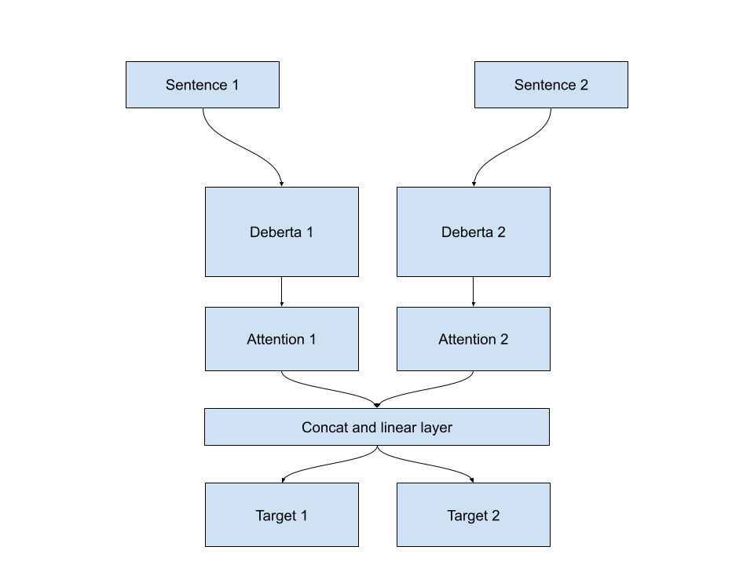

# Pairwise model for commonlit competition

To run:

    - install requirements
    - create input directory with train_folds.csv and other competition data
    - cd src 
    - sh run.sh

Score: 0.466 OOF, Public: 0.462 LB, Private: 0.464 LB

Model arch:

